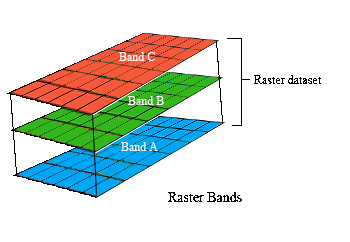

# Data {#data}

## Starting out

We will start out by opening RStudio. Ideally, you should have already installed this before the workshop. If you have not done this already, then please see the Setup section. After opening RStudio, we will start by entering code to attach some packages that will make our lives much easier.

```{r, message = FALSE}
# load packages
library(tidyverse)
library(prioritizr)
library(rgdal)
library(raster)
library(mapview)
```

You should have already downloaded the data for the prioritizr module of this workshop. If you have not already done so, you can download it from here: https://github.com/prioritizr/cibio-workshop/raw/master/data.zip. After downloading the data, you can unzip the data into a new folder. Next, you will need to set the working directory to this new folder. To achieve this, click on the _Session_ button on the RStudio menu bar, then click _Set working directory_, and then _Choose Directory_.


Now navigate to the folder where you unzipped the data and select _Open_. You can verify that you have correctly set the working directory using the following R code. You should see the output `TRUE`.

```{r, include = FALSE}
if (!file.exists("data/pu.shp"))
  unzip("data.zip")
setwd("data")
```

```{r}
file.exists("data/pu.shp")
```

```{r, include = FALSE}
setwd("..")
```

## Data import

Now that we have downloaded the dataset, we will need to import it into our R session. Specifically, this data was obtained from the "Introduction to Marxan" course and was originally a subset of a larger spatial prioritization project performed under contract to Australia’s Department of Environment and Water Resources. It contains vector-based planning unit data (`pu.shp`)and the raster-based data describing the spatial distributions of 62 vegetation classes (`vegetation.tif`) in Tasmania, Australia. We can import the data into our R session using the following code.

```{r}
# import planning unit data
pu_data <- readOGR("data/pu.shp")

# import vegetation data
veg_data <- stack("data/vegetation.tif")
```

## Planning unit data

The planning unit data contains spatial data describing the geometry for each planning unit and attribute data with information about each planning unit (e.g. cost values). Let's investigate the `pu_data` object. The attribute data contains `r ncol(pu_data)` columns with contain the following information:
* `id`: unique identifiers for each planning unit
* `cost`: acquisition cost values for each planning unit
* `status`: status information for each planning unit (only relevant with Marxan)
* `locked_in`: binary values (i.e. one or zero) indicating if planning units are covered by protected areas or not.
* `locked_out`: binary values (i.e. one or zero) indicating if planning units cannot be managed as a protected area because they contain too much anthropologically altered land.

```{r}
# print a short summary of the data
print(pu_data)

# plot the planning unit data
plot(pu_data)
```

```{r, eval = FALSE}
# plot an interactive map of the planning unit data
mapview(pu_data)
```

```{r}
# print the structure of object
str(pu_data, max.level = 2)

# print the class of the object
class(pu_data)

# print the slots of the object
slotNames(pu_data)

# print the geometry for the 80th planning unit
pu_data@polygons[[80]]

# print the coordinate reference system
print(pu_data@proj4string)

# print number of planning units (geometries) in the data
nrow(pu_data)

# print the first six rows in the attribute data
head(pu_data@data)

# print the first six values in the cost column of the attribute data
head(pu_data$cost)

# print the highest cost value
max(pu_data$cost)

# print the smallest cost value
min(pu_data$cost)

# print average cost value
mean(pu_data$cost)

# plot a map of the planning unit cost data
spplot(pu_data, "cost")
```

```{r, eval = FALSE}
# plot an interactive map of the planning unit cost data
mapview(pu_data, zcol = "cost")
```

Now, you can try and answer some questions about the planning unit data.

```{block2, type="rmdcaution"}
1. How many planning units are in the planning unit data?
2. What is the highest cost value?
3. How many planning units are covered by the protected areas (hint: `sum(x)`)?
4. What is the proportion of the planning units that are covered by the protected areas (hint: `mean(x)`)?
5. How many planning units are dominated by anthropologically altered land (hint: `sum(x)`)?
6. What is the proportion of planning units dominated by anthropologically altered land (hint: `sum(x)`)?
7. Can you verify that all values in the `locked_in` and `locked_out` columns are zero or one (hint: `min(x)` and `max(x)`)?.
8. Can you verify that none of the planning units are missing cost values (hint: `all(is.finite(x))`)?.
9. Can you very that none of the planning units have duplicated identifiers? (hint: `n_distinct(x)`)?
10. Is there a spatial pattern in the planning unit cost values (hint: make a map).
11. Is there a spatial pattern in where most planning units are covered by protected areas (hint: make a map of `locked_in`).

```

## Vegetation data

The vegetation data describes the spatial distribution of 62 vegetation classes in the study area. This data is in a raster format and so the data are organized using a regular spatial grid with square grid cells. In our case, our raster data contains multiple layers (also called "bands") and each layer has corresponds to a spatial grid with exactly the same area and has exactly the same dimensionality (i.e. number of rows, columns, and cells). In this dataset, there are 62 different regular spatial grids layered on top of each other -- with each layer corresponding to a different vegetation class -- and each of these layers contains a grid with `r nrow(veg_data)` columns, `r ncol(veg_data)` rows, and `r formatC(ncell(veg_data), big.mark=",")` cells. Within each layer, each cell corresponds to a `r xres(veg_data)/1000` by `r yres(veg_data)/1000` km square. The values associated with each grid cell contain values (i.e. one or zero) indicating the presence or absence of a given vegetation class in the cell.



Let's explore the vegetation data.

```{r}
# print a short summary of the data
print(veg_data)

# plot a map of the 36th vegetation class
plot(veg_data[[36]])
```

```{r, eval = FALSE}
# plot an interactive map of the 36th vegetation class
mapview(veg_data[[36]])
```

```{r}
# print information about the spatial grid
nrow(veg_data)    # number of rows
ncol(veg_data)    # number of columns
ncell(veg_data)   # number of cells
nlayers(veg_data) # number of layers
xres(veg_data)    # resolution on the x-axis
yres(veg_data)    # resolution on the y-axis
extent(veg_data)  # spatial extent of the grid, i.e. coordinates for corners

# print the coordinate reference system
print(veg_data@crs)

# print a summary of the first layer in the stack
print(veg_data[[1]])

# print the value in the 800th cell in the first layer of the stack
print(veg_data[[1]][800])

# print the value of the cell located in the 30th row and the 60th column of
# the first layer
print(veg_data[[1]][30, 60])

# calculate the sum of all the cell values in the first layer
cellStats(veg_data[[1]], "sum")

# calculate the maximum value of all the cell values in the first layer
cellStats(veg_data[[1]], "max")

# calculate the minimum value of all the cell values in the first layer
cellStats(veg_data[[1]], "min")

# calculate the mean value of all the cell values in the first layer
cellStats(veg_data[[1]], "mean")

# calculate the maximum value in each layer
data.frame(max = cellStats(veg_data, "max"))
```

Now, you can try and answer some questions about the vegetation data.

```{block2, type="rmdcaution"}
1. What part of the study area is the 51st vegetation class found in (hint: make a map)?
2. How many rows does the 23rd layer contain?
3. Is the third vegetation class present at the 400th cell?
4. How many cells contain the 56th vegetation class?
5. What proportion of cells contain the 12th vegetation class?
6. Which vegetation class is present in the greatest number of cells?
7. Make an new object by summing together all the layer values into a single grid (i.e. `sum_veg_data <- sum(veg_data)`) and make a map showing this data (i.e. `plot(sum_veg_data)`). What does it mean if cells contain zeros in this new object? Look at the spatial pattern of the cells containing zeros, can you think of a biological explanation for their location?

```
