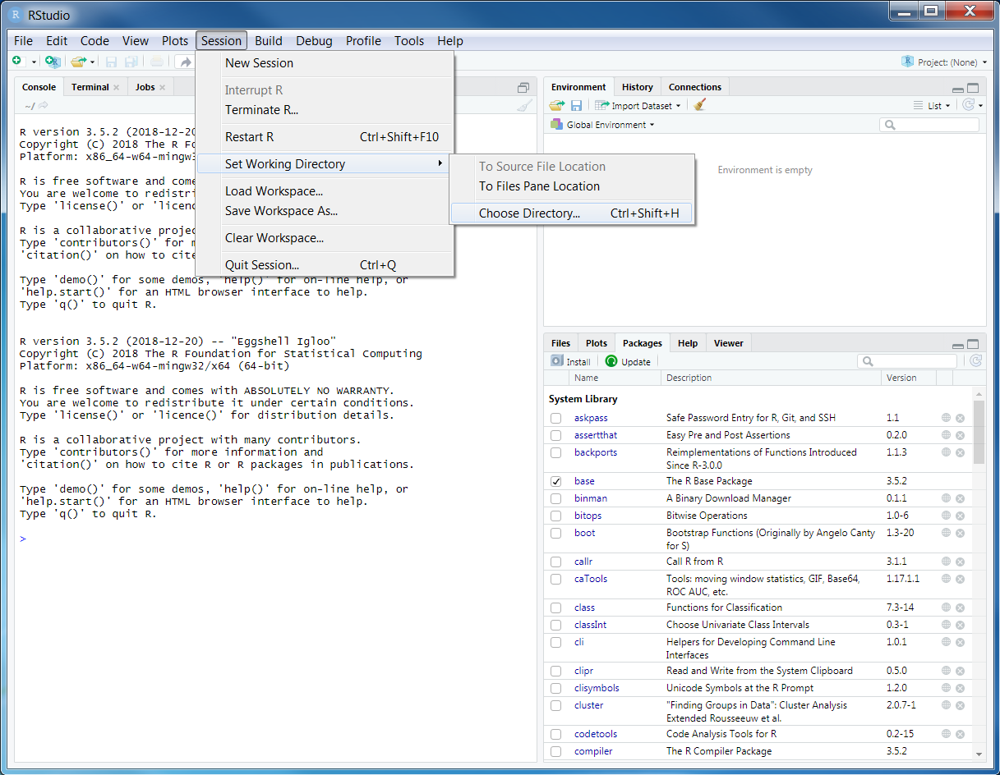

# (PART) Exercises {-}

# Data exploration {#data-exploration}

## Starting out

We will start out by opening RStudio. Ideally, you should have already installed this before the workshop. If you have not done this already, then please see the Setup section. After opening RStudio, we will start by entering code to attach some packages that will make our lives much easier.

```{r, message = FALSE}
library(prioritizr)
library(rgdal)
library(raster)
library(tidyverse)
```

You should have already downloaded the data for the prioritizr module of this workshop. If you have not already done so, you can download it from here: https://github.com/prioritizr/cibio-workshop/raw/master/data.zip. After downloading the data, you can unzip the data into a new folder. Next, you will need to set the working directory to this new folder. To achieve this, click on the _Session_ button on the RStudio menu bar, then click _Set working directory_, and then _Choose Directory_.



Now navigate to the folder where you unzipped the data and select _Open_. You can verify that you have correctly set the working directory using the following R code. You should see the output `TRUE`.

```{r, include = FALSE}
if (!file.exists("data/pu.shp"))
  unzip("data.zip")
setwd("data")
```

```{r}
file.exists("data/pu.shp")
```

```{r, include = FALSE}
setwd("..")
```

## Data import

Now that we have downloaded the dataset, we will need to import it into our R session. Specifically, this data was obtained from the "Introduction to Marxan" course and was originally a subset of a larger spatial prioritization project performed under contract to Australia’s Department of Environment and Water Resources. It contains vector-based planning unit data (`pu.shp`)and the distributions of 63 vegetation classes (`vegetation.tif`) in Tasmania, Australia. We can import the data into our R session using the following code.

```{r}
# import planning unit data
pu_data <- readOGR("data/pu.shp")

# import vegetation data
veg_data <- stack("data/vegetation.tif")
```

## Planning unit data

The planning unit data contains spatial data describing the geometry for each planning unit and attribute data with information about each planning unit (e.g. cost values). Let's investigate the `pu_data` object. The attribute data contains `r ncol(pu_data)` columns with contain the following information:
* `"id"`: unique identifiers for each planning unit
* `"cost"`: acquisition cost values for each planning unit
* `"status"`: status information for each planning unit (only relevant with Marxan)
* `"locked_in"`: binary values (i.e. one or zero) indicating if planning units are covered by protected areas or not.
* `"locked_out"`: binary values (i.e. one or zero) indicating if planning units cannot be managed as a protected area because they contain too much anthropologically altered land.

```{r}
# print a short summary of the data
print(pu_data)

# print the structure of object
str(pu_data, max.level = 3)

# print the class of the object
class(pu_data)

# print the slots of the object
slotNames(pu_data)

# print the geometry for the first planning unit
pu_data@polygons[[1]]

# print the coordinate reference system
print(pu_data@proj4string)

# print number of planning units (geometries) in the data
nrow(pu_data)

# print the first six rows in the attribute data
head(pu_data@data)

# print the first six values in the cost column of the attribute data
head(pu_data$cost)

# print the highest cost value
max(pu_data$cost)

# print the smallest cost value
min(pu_data$cost)

# print average cost value
mean(pu_data$cost)
```

```{block2, note-text, type="rmdcaution"}
1. How many planning units are in the planning unit data? **`r include = show_answers, nrow(pu_data)`**
2. What is the highest cost value?
3. How many planning units are covered by the protected areas (hint: `sum(x)`)?
3. What is the proportion of the planning units that are covered by the protected areas (hint: `mean(x)`)?
4. How many planning units are dominated by anthropologically altered land (hint: `sum(x)`)?
4. What is the proportion of planning units dominated by anthropologically altered land (hint: `sum(x)`)?
5. Can you verify that all values in the `"locked_in"` and `"locked_out"` columns are zero or one (hint: `min(x)` and `max(x)`)?.
6. Can you verify that none of the planning units are missing cost values (hint: `all(is.finite(x))`)?.
7. Can you very that none of the planning units have duplicated identifiers? (hint: `n_distinct(x)`)?
```
